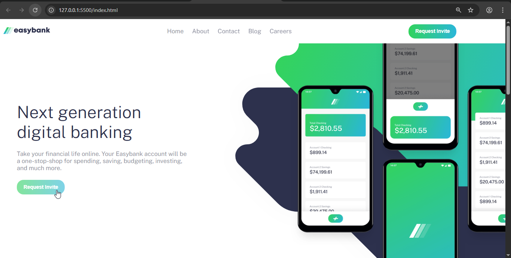
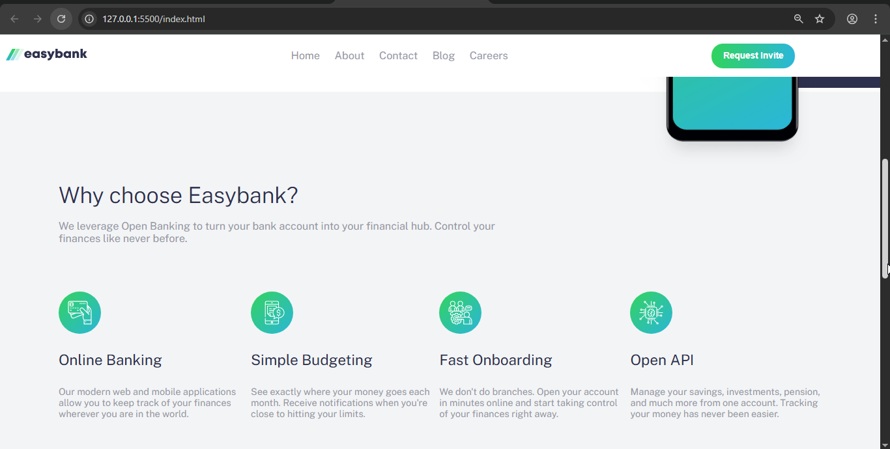
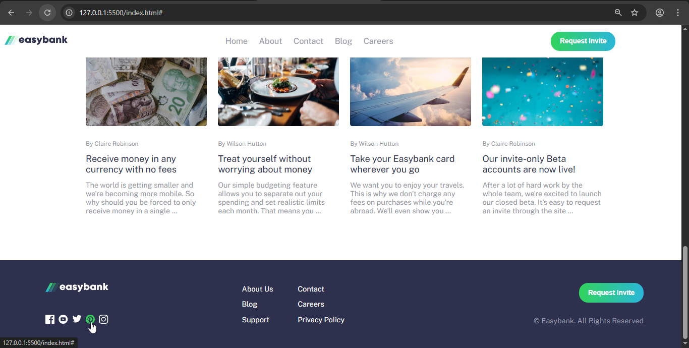
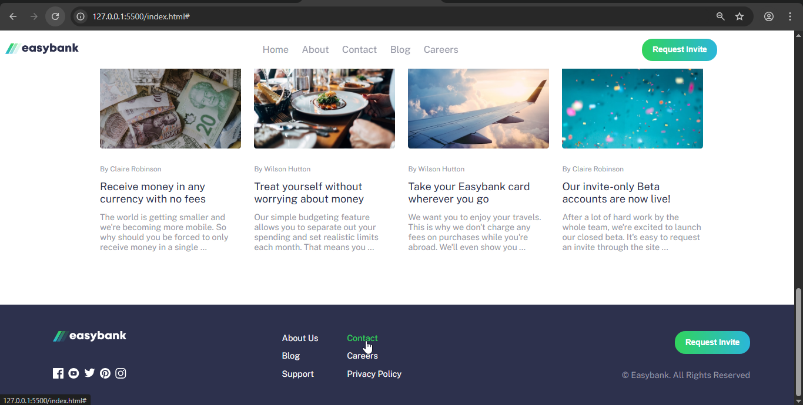
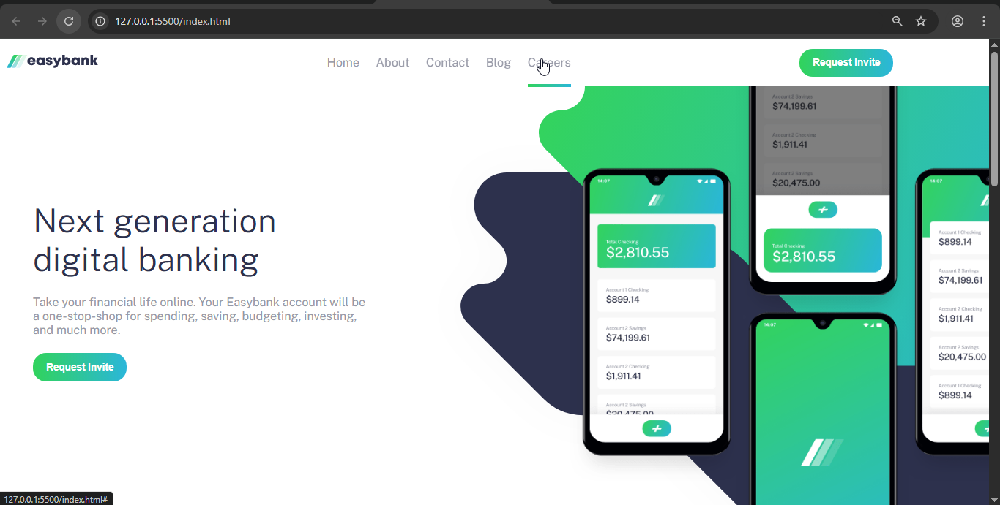
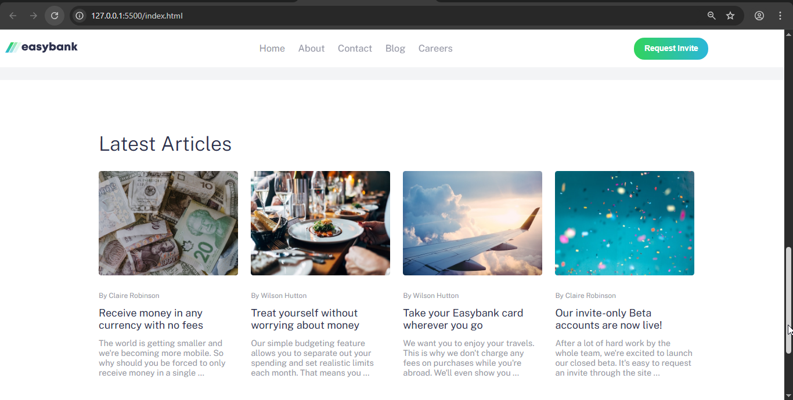
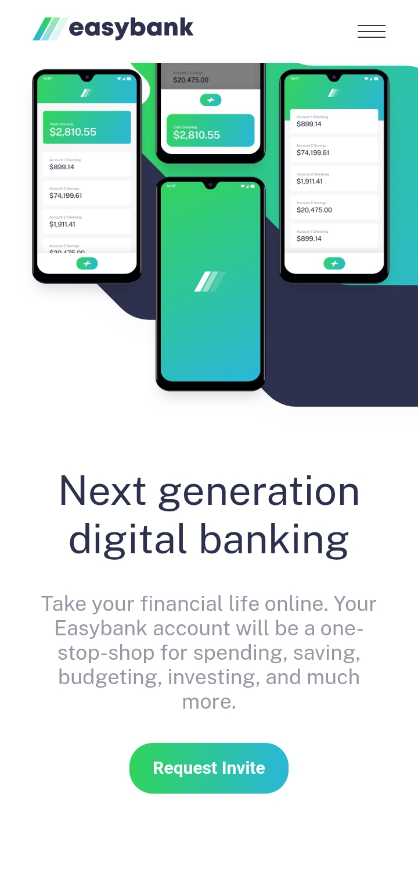
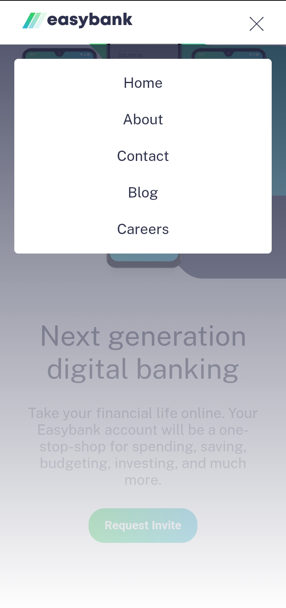
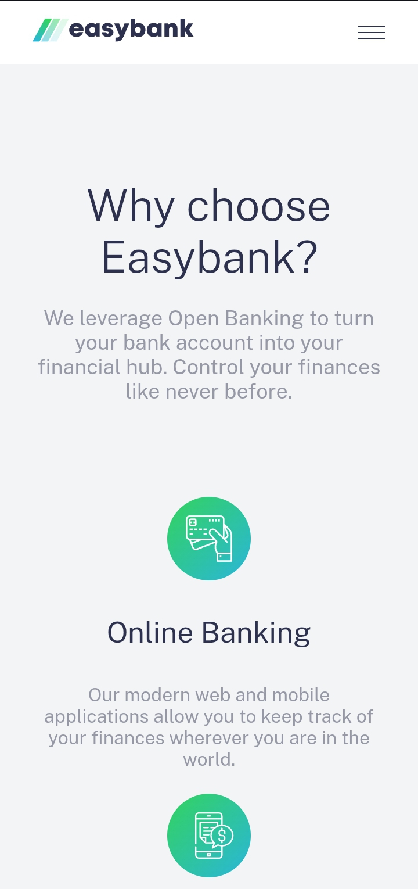
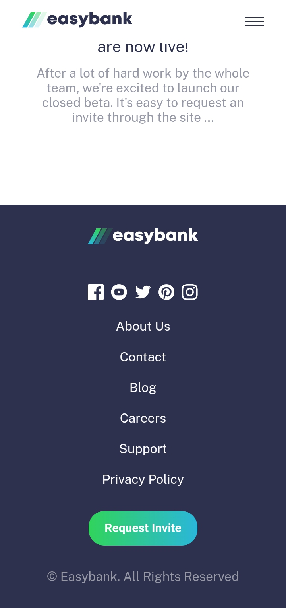

# Frontend Mentor - Easybank landing page solution

This is a solution to the [Easybank landing page challenge on Frontend Mentor](https://www.frontendmentor.io/challenges/easybank-landing-page-WaUhkoDN). Frontend Mentor challenges help you improve your coding skills by building realistic projects.

## Table of contents

* [Overview](#overview)

  * [The challenge](#the-challenge)
  * [Screenshot](#screenshot)
  * [Links](#links)
* [My process](#my-process)

  * [Built with](#built-with)
  * [What I learned](#what-i-learned)
  * [Continued development](#continued-development)
  * [Useful resources](#useful-resources)
* [Author](#author)
* [Acknowledgments](#acknowledgments)

## Overview

### The challenge

Users should be able to:

* View the optimal layout for the site depending on their device's screen size
* See hover states for all interactive elements on the page

### Screenshot















### Links

* Solution URL: [Add solution URL here](https://your-solution-url.com)
* Live Site URL: (https://maxessien.github.io/FEM-Easy-banking-Landing-Page/)

## My process

### Built with

* Semantic HTML5 markup
* CSS custom properties
* Flexbox
* Mobile-first workflow
* JavaScript (Vanilla)

### What I learned

This project helped me solidify my understanding of:

```js
// DOM selection and manipulation
const menu = document.querySelector(".hamburger-menu");
menu.addEventListener("click", () => {
  // Toggle nav visibility
});
```

```css
/* CSS Variables and responsive design */
:root {
  --primary-color: hsl(233, 26%, 24%);
}

@media (min-width: 768px) {
  .nav {
    display: flex;
  }
}
```

### Continued development

I want to explore:

* JavaScript animations using the Web Animations API
* Accessibility best practices
* ARIA roles for navigation elements

## Author

* Website - [Max Essien](https://github.com/Maxessien/nav-template-demo)
* Frontend Mentor - [@Maxessien](https://www.frontendmentor.io/profile/Maxessien)

## Acknowledgments

Thanks to Frontend Mentor for the awesome challenge and all the community solutions that inspired parts of this build.
